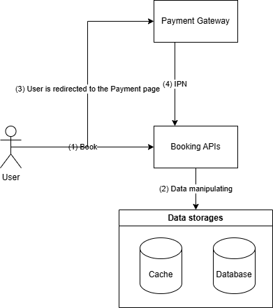
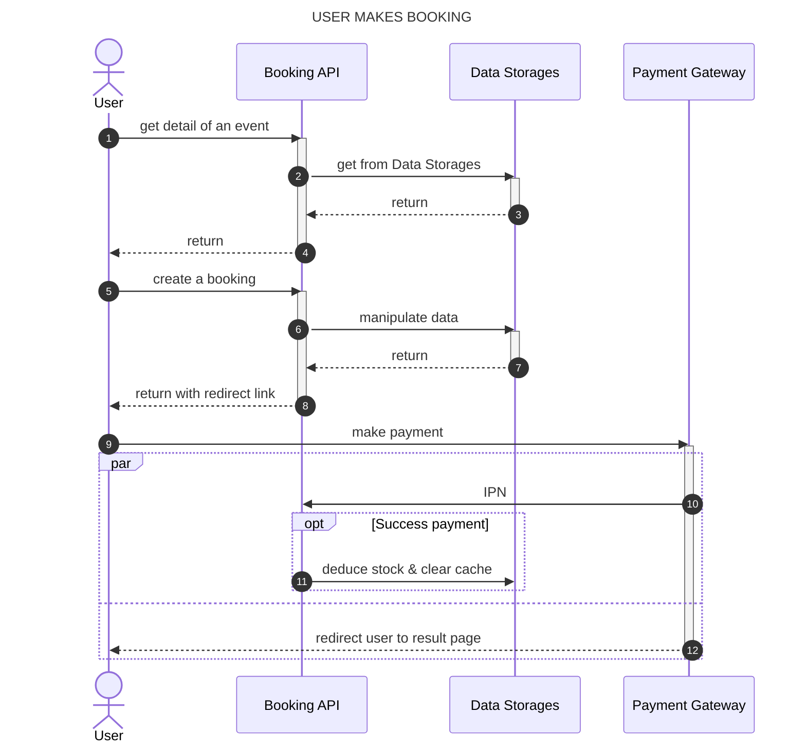

# Architecture decision record

## Context

We need a scalable and robust backend system for a global event booking platform that can handle a large number of users, especially during peak hours close to event dates. The system should allow users to easily search and book events happening worldwide, ensuring a smooth booking experience even under high traffic. The booking rocess should integrate with a payment gateway (e.g., Stripe) to handle ticket purchases securely. Upon successful booking, the system should send confirmation and  reminder notifications to the users before the event takes place.

Assumptions:

1. We don't have to implement Authorization and Authentication for a user.
2. We don't implement the payment integration, we just need implement a mock payment service.
3. The confirmation will be sent in an email have it has an option to add to Google Calendar for reminder notifications, we don't implement this.
4. We don't implement Cart feature. When a user chooses the number of the tickets of an event, they need to pay immediately.

## Discussions

### [01] Simple architecture diagram

1. **User** books an event
2. **Booking APIs** manipulate data:
    1. get event details from Database or Cache;
    2. insert bookings
3. The response of Create Booking API contains a link to redirect **User** to payment page of **Payment Gateway**. User makes payment and is redirected to the result page.
4. **Payment Gateway** sends an IPN to **Booking APIs** to confirm the result of the payment.

### [02] Sequence diagram

### [03] Design guideline

1. API:
   1. Follow RESTFul guideline.
   2. IMPORTANT: IPN is the creterium to determine a payment is success or not, redirect link of the Payment Gateway is not.
2. Cache:
   1. Using Redis 6+: Redis 6 starts to use multiple threads handle connections, performance is more improved compare to Redis 5-.
   2. Use `{` and `}` to arrange keys into the same hash slot, can help read faster.
   3. Cache strategies:
      1. Read: Cache aside
      2. Write: Write around variant, we delete cached data instead update them.
3. Database:
   1. Using PostgreSQL.
   2. All the primary key use UUID v7: for universal unique and universal order.
   3. Use `pgbouncer` to manage connection pool.
4. We have to init a cache key to store detail of an event:
   1. Key format: `event:{<ID of the event>}`
   2. Data type: Hashmap.
   3. There is a `instock` field to store the number in-stock tickets of this event.
      1. When a user chooses to book (not yet paid): `HINCRBY event:{<ID of the event>} instock -<number of tickets>`.
      2. When a user cancel booking or payment failed: `HINCRBY event:{<ID of the event>} instock <number of tickets>`.
